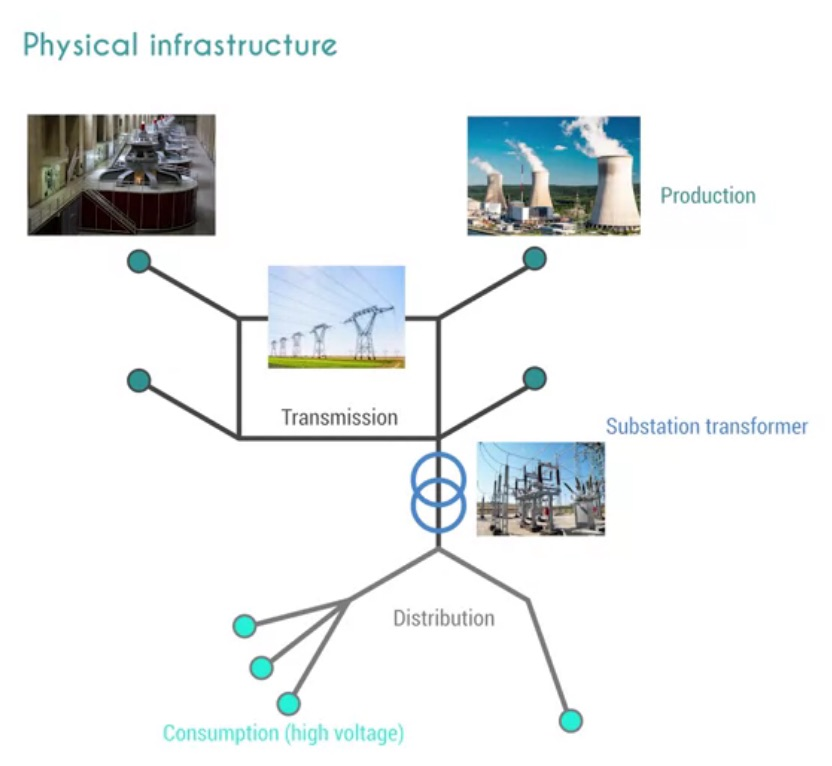
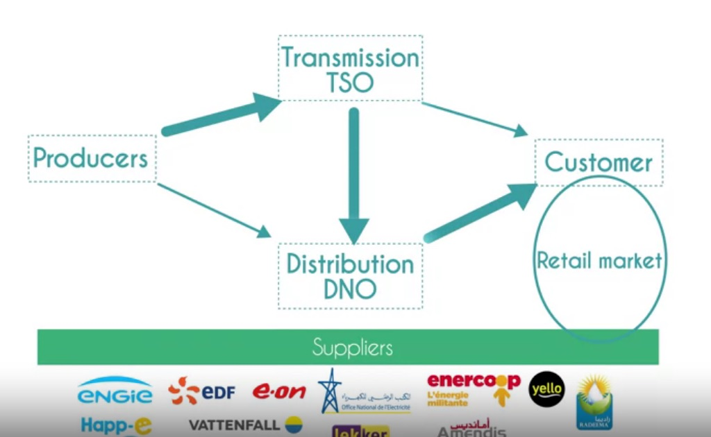
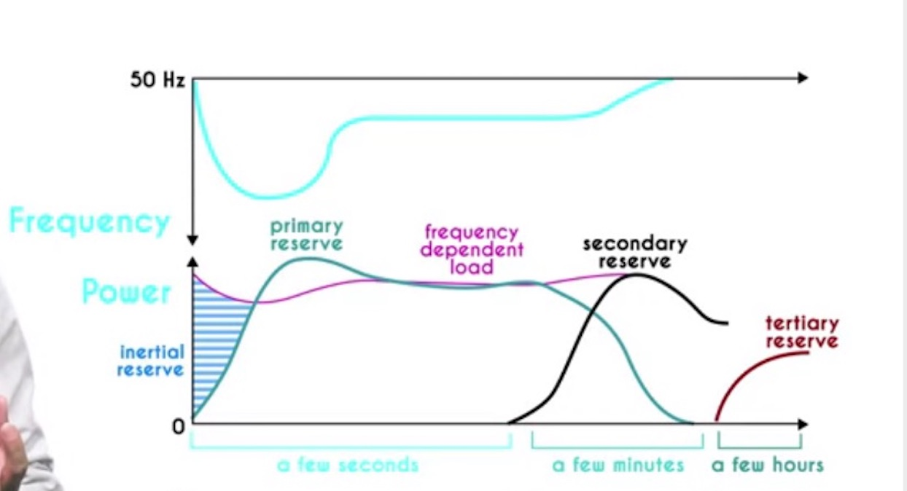

# Outsmarting intermittency: adding renewable energy to the electrical grid

_Notes and excerpts from the course [Outsmarting intermittency](https://www.coursera.org/learn/outsmarting-intermittency) by [instructors](https://www.coursera.org/learn/outsmarting-intermittency#instructors) Erik Johnson, Yvan Bonnassieux and Daniel Suchet._

# Overview
The electrical grid is not a simple electron pipe. It is the beating heart of our electricity system and ensures its stability. Solar and wind raise specific challenges for the grid: these challenges will have to be tackled if we want to deploy larger amounts of renewable sources. 

# 1) Electrical grid
## Grid integration what, why, how

The electrical grid includes what comes between power production and power consumption.

Production must match demand at all times. Not at a year's scale, but every second.

Supply varies as well, especially with renewable sources which are sensitive to weather conditions.

If supply exceeds demand, devices will be overloaded, and have to be disconnected to avoid heavy damage. 

If demand exceeds supply, there is of course not enough electricity to power all connected appliances.
Too large demand leads to strong stress on power generators: turbines have to be disconnected to avoid permanent damage. 
As power sources are removed from the grid, the imbalance worsens, inducing a cascade of failures. The collapse of the electrical system is called, a **blackout**.

## Physical infrastructure

### Transport network
Connects generators to a high voltage _transmission_ or _transport network_.

Generators produce energy. 

A step-up transformer increases the voltage to levels as high as a million volts or 1,000 kilovolts but more typically a few 100 kilovolts. It reduces the current and therefore the losses in the lines.

The electrical current then flows along high-voltage or high tension lines through what is called the transmission or transport network.

### Distribution network
Such high voltages are not suited for use and consumption:

After transmission over long distances, the electrical cables enter an electrical 
substation where the voltage is decreased using step-down transformer or transformers.

The electricity now passes onto what is called the _distribution grid_. The overhead or underground lines of the distribution grid still have voltages of around 20 kilovolts

The distribution grid is designed differently than the transport grid and it is arborescent or tree-like and also includes loops for redundancy.

### Consumption
Finally, the voltage is decreased to a level appropriate for use within the household. The transformers doing this step may be in residential zones and can even be pole mounted.

The voltage is now at a relatively low level, such as between 220-240 volts in Europe. 

### Renewables integration
While there are efficiencies to be gained by building huge centralized production sources, the diffuse nature of renewable energy sources like wind and solar requires that they be distributed. This means that the power they generate is often injected into the grid at the distribution level, 20 kilovolt level. For example, in France, all traditional sources thermal, nuclear, hydro inject power into the transport grid. Whereas 90 percent of wind and solar are injected into the distribution grid.

## Who's who

Grid actors:
* Producers can be major companies such as EDF and ENGIE in France, or E.ON, RWE, EnBW, and Vattenfall in Germany. 

* TSO: Transmission System Operator. TSOs are directly responsible for the stability of the power grid, and transmission is usually a regulated sector. TSOs can own the grid infrastructure or simply operate them.

* DNOs: The electricity flows to the distribution network, which is handled by DNOs, Distribution Network Operators.

* Consumption: 
  * Finally, the electricity is delivered to the customer from the household to the industrial plant.
  * Some very large consumers, such as large factories, are powered directly from the transmission system. 
  * Small-scale production and especially decentralized **renewable sources** are not injected in the transmission system, but **directly into the distribution network**. An auto-consumption is the direct power transfer from production to consumption.

 Retailers: purchase the power corresponding to their portfolio on the wholesale market, either over the counter with producers or on trading markets

 ## Bonus electricity 101
 
 I: electrical current, akin to a waterflow debit.
 V: electrical potential: why there is "water" flowing (ex for a river: altitude difference)
 R: resistance, akin to size & length of a pipe

# 2) Grid stability timeline
## The time scales of power balance

If consumption > production, system becomes unstable. Then the following happens:

* **Frequency response reserve (ms->s)**: generator rotational frequency starts to diminish (diminished inertia) to generate more power

* **Primary reserve / spinning reserve (30s->15min)**: additional fuel is therefore sent to the turbine to increase its torque and it will start to produce more power. Enough to cover the additional power consumption. The additional power available by increasing the output of online machines is called the spinning reserve, primary reserve, or the frequency containment reserve, FCR. Making this power available occurs within 30 seconds, occurs automatically and continues for up to 15 minutes.

* **Secondary reserve / non-spinning reserve (0-10min)**: We would then start up another Fast Start generator and bring it online. This generator will allow us to restore the inertia in the turbine by bringing the frequency back up to its initial value. The first generator can now have its power reduced and operate closer to its nominal value. This reserves are meant to be able to be brought online quickly and react for the most part in response to events. 

* **Tertiary reserve (30-60min)**: Finally, we could start another bigger & slower starting generator (manual frequency restoration reserve or just replacement reserve). We could also ask people to lower their consumptions otherwise, but we now have room for additional consumption if needed.

## Why is grid stability critical - when things go wrong

Systems need to be designed and dimension to deal with worst case scenarios.

If a decrease in production or increase in consumption is too great and sudden, it can set off a much more than furious series of events. **The spinning generators that are producing electricity decreased rapidly in efficiency if they fall below a certain rotational speed**. If the frequency of the network decreases too quickly before other reserves can compensate, then the turbines producing power may cross over a critical threshold where any further reduction in frequency also reduces their power output. Left unchecked, this situation would set up a very nasty **positive feedback loop and caused the entire network to collapse** violently, **destroying generating equipment** at the worst **or making them very difficult to restart**.

 In some systems, it's possible for the grid operators to slightly lower the voltage at the point of use and therefore reduce power consumption evenly across a zone. This is called a **brownout**.

 In a more drastic step, some consumers can be completely disconnected from the grid to reduce consumption and limit the imbalance. This is called a **rolling blackout, or load shedding**, and it is imposed when the frequency goes below certain fixed thresholds: **49, 48.5, 48 and 47.5 hertz in Europe**

 If the frequency goes below 46 herts, less than 10% away from the nominal value, generators will disconnect from the grid.

 The gap between production and consumption will then widen in an uncontrolled way until all power units are disconnected. This is a **blackout**.

# 3) Challenges - Introduction and Dispatchability