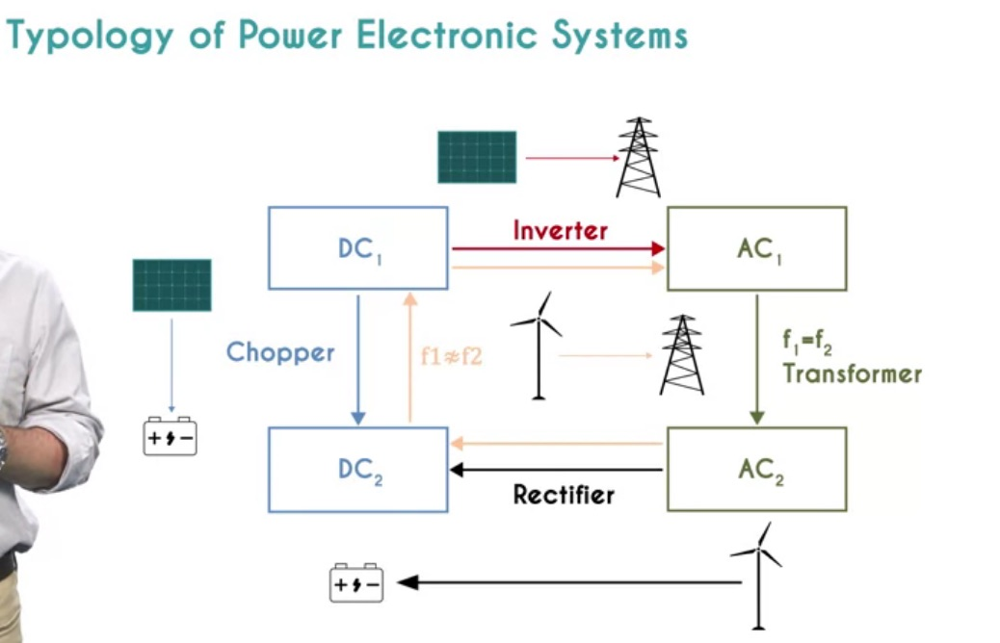
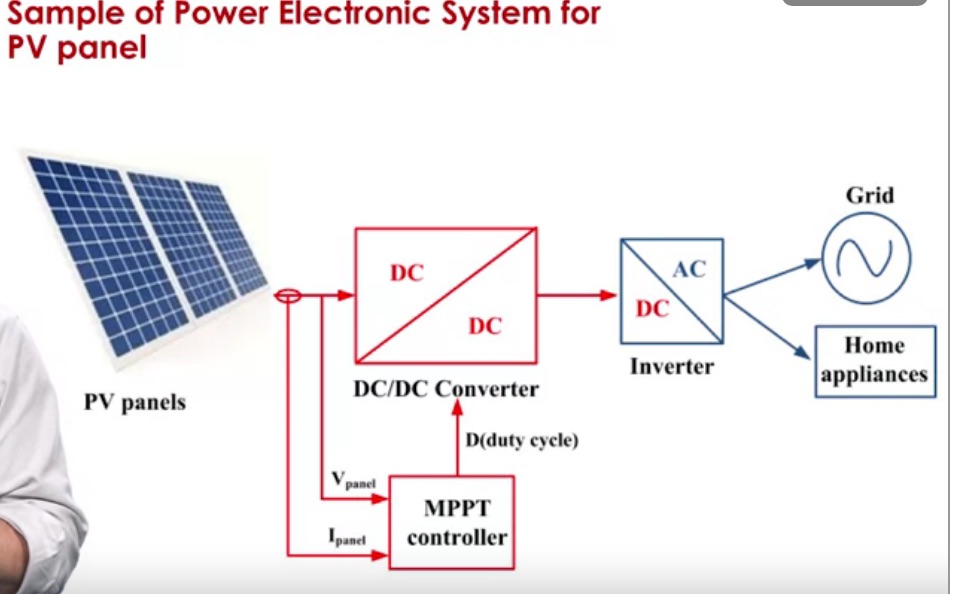
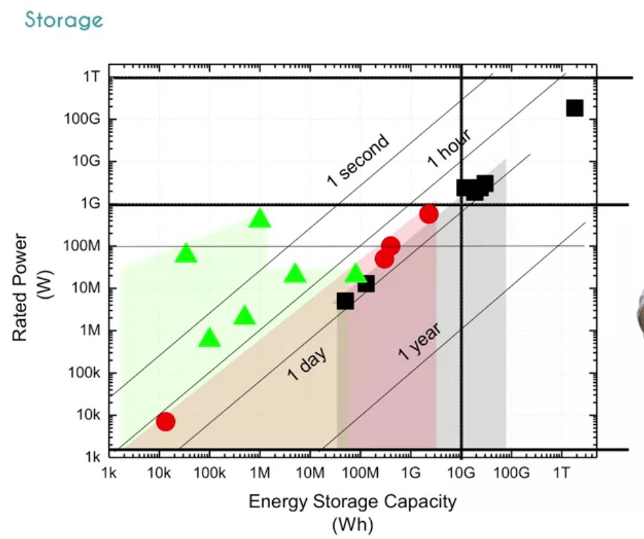
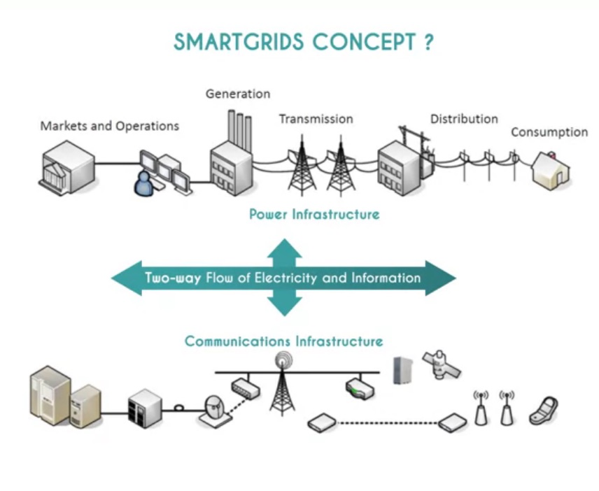
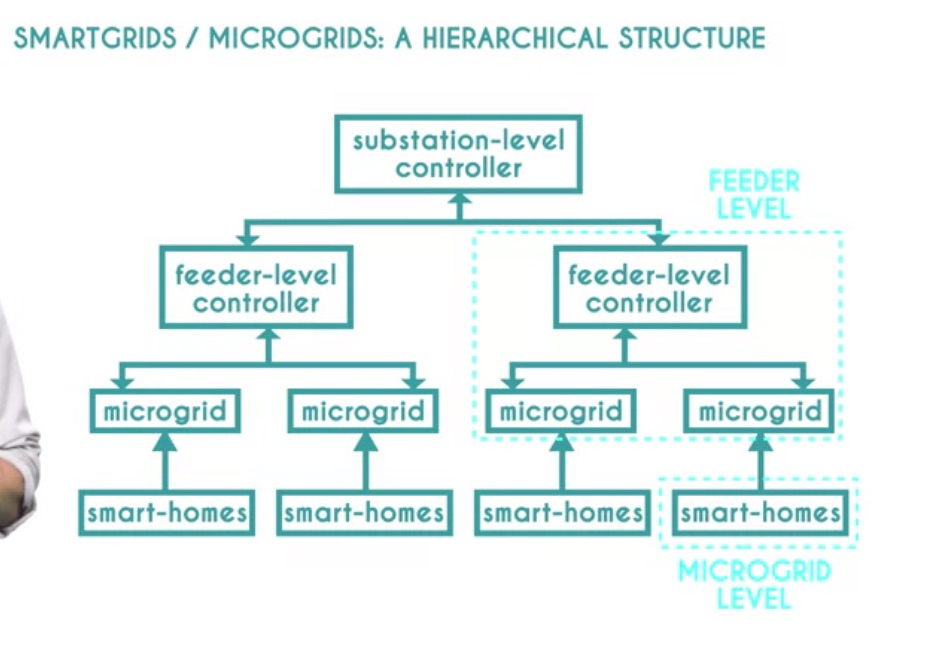

# Outsmarting intermittency: adding renewable energy to the electrical grid

_Notes and excerpts from the course [Outsmarting intermittency](https://www.coursera.org/learn/outsmarting-intermittency) by [instructors](https://www.coursera.org/learn/outsmarting-intermittency#instructors) Erik Johnson, Yvan Bonnassieux and Daniel Suchet._

# Overview
The electrical grid is not a simple electron pipe. It is the beating heart of our electricity system and ensures its stability. Solar and wind raise specific challenges for the grid: these challenges will have to be tackled if we want to deploy larger amounts of renewable sources. 

# 1) Electrical grid
## Grid integration what, why, how

The electrical grid includes what comes between power production and power consumption.

Production must match demand at all times. Not at a year's scale, but every second.

Supply varies as well, especially with renewable sources which are sensitive to weather conditions.

If supply exceeds demand, devices will be overloaded, and have to be disconnected to avoid heavy damage. 

If demand exceeds supply, there is of course not enough electricity to power all connected appliances.
Too large demand leads to strong stress on power generators: turbines have to be disconnected to avoid permanent damage. 
As power sources are removed from the grid, the imbalance worsens, inducing a cascade of failures. The collapse of the electrical system is called, a **blackout**.

## Physical infrastructure

### Transport network
Connects generators to a high voltage _transmission_ or _transport network_.

Generators produce energy. 

A step-up transformer increases the voltage to levels as high as a million volts or 1,000 kilovolts but more typically a few 100 kilovolts. It reduces the current and therefore the losses in the lines.

The electrical current then flows along high-voltage or high tension lines through what is called the transmission or transport network.

### Distribution network
Such high voltages are not suited for use and consumption:

After transmission over long distances, the electrical cables enter an electrical 
substation where the voltage is decreased using step-down transformer or transformers.

The electricity now passes onto what is called the _distribution grid_. The overhead or underground lines of the distribution grid still have voltages of around 20 kilovolts

The distribution grid is designed differently than the transport grid and it is arborescent or tree-like and also includes loops for redundancy.

### Consumption
Finally, the voltage is decreased to a level appropriate for use within the household. The transformers doing this step may be in residential zones and can even be pole mounted.

The voltage is now at a relatively low level, such as between 220-240 volts in Europe. 

### Renewables integration
While there are efficiencies to be gained by building huge centralized production sources, the diffuse nature of renewable energy sources like wind and solar requires that they be distributed. This means that the power they generate is often injected into the grid at the distribution level, 20 kilovolt level. For example, in France, all traditional sources thermal, nuclear, hydro inject power into the transport grid. Whereas 90 percent of wind and solar are injected into the distribution grid.

## Who's who

Grid actors:
* Producers can be major companies such as EDF and ENGIE in France, or E.ON, RWE, EnBW, and Vattenfall in Germany. 

* TSO: Transmission System Operator. TSOs are directly responsible for the stability of the power grid, and transmission is usually a regulated sector. TSOs can own the grid infrastructure or simply operate them.

* DNOs: The electricity flows to the distribution network, which is handled by DNOs, Distribution Network Operators.

* Consumption: 
  * Finally, the electricity is delivered to the customer from the household to the industrial plant.
  * Some very large consumers, such as large factories, are powered directly from the transmission system. 
  * Small-scale production and especially decentralized **renewable sources** are not injected in the transmission system, but **directly into the distribution network**. An auto-consumption is the direct power transfer from production to consumption.

 Retailers: purchase the power corresponding to their portfolio on the wholesale market, either over the counter with producers or on trading markets

 ## Bonus electricity 101
 
 I: electrical current, akin to a waterflow debit.
 V: electrical potential: why there is "water" flowing (ex for a river: altitude difference)
 R: resistance, akin to size & length of a pipe

# 2) Grid stability timeline
## The time scales of power balance

If consumption > production, system becomes unstable. Then the following happens:

* **Frequency response reserve (ms->s)**: generator rotational frequency starts to diminish (diminished inertia) to generate more power

* **Primary reserve / spinning reserve (30s->15min)**: additional fuel is therefore sent to the turbine to increase its torque and it will start to produce more power. Enough to cover the additional power consumption. The additional power available by increasing the output of online machines is called the spinning reserve, primary reserve, or the frequency containment reserve, FCR. Making this power available occurs within 30 seconds, occurs automatically and continues for up to 15 minutes.

* **Secondary reserve / non-spinning reserve (0-10min)**: We would then start up another Fast Start generator and bring it online. This generator will allow us to restore the inertia in the turbine by bringing the frequency back up to its initial value. The first generator can now have its power reduced and operate closer to its nominal value. This reserves are meant to be able to be brought online quickly and react for the most part in response to events. 

* **Tertiary reserve (30-60min)**: Finally, we could start another bigger & slower starting generator (manual frequency restoration reserve or just replacement reserve). We could also ask people to lower their consumptions otherwise, but we now have room for additional consumption if needed.

## Why is grid stability critical - when things go wrong

Systems need to be designed and dimension to deal with worst case scenarios.

If a decrease in production or increase in consumption is too great and sudden, it can set off a much more than furious series of events. **The spinning generators that are producing electricity decreased rapidly in efficiency if they fall below a certain rotational speed**. If the frequency of the network decreases too quickly before other reserves can compensate, then the turbines producing power may cross over a critical threshold where any further reduction in frequency also reduces their power output. Left unchecked, this situation would set up a very nasty **positive feedback loop and caused the entire network to collapse** violently, **destroying generating equipment** at the worst **or making them very difficult to restart**.

 In some systems, it's possible for the grid operators to slightly lower the voltage at the point of use and therefore reduce power consumption evenly across a zone. This is called a **brownout**.

 In a more drastic step, some consumers can be completely disconnected from the grid to reduce consumption and limit the imbalance. This is called a **rolling blackout, or load shedding**, and it is imposed when the frequency goes below certain fixed thresholds: **49, 48.5, 48 and 47.5 hertz in Europe**

 If the frequency goes below 46 herts, less than 10% away from the nominal value, generators will disconnect from the grid.

 The gap between production and consumption will then widen in an uncontrolled way until all power units are disconnected. This is a **blackout**.

# 3) Challenges

## Introduction and Dispatchability
**The reduced inertia and the non dispatch ability of wind and solar (intermittency) sources make it difficult for them to contribute to power balance and frequency stability.**

**dispatch-ability**: Dispatchable generation refers to sources of electricity that can be dispatched on demand at the request of power grid operators, according to market needs. [wiki](https://en.wikipedia.org/wiki/Dispatchable_generation)

**Non dispatch-ability**: wind turbine depends on wind speed, and solar on sun presence. These factors cannot be controlled (but forecasted, see later)

**asynchronous source** a transforming step is needed: Wind turbine has a raw output frequency that varies with the wind speed, and the raw output of a solar panel is not even alternating current but direct current. For these productions to contribute to the 50 hertz electricity of the grid a transforming steps is required. 

**Low/null inertia**: because of this **decoupling, the contribution of these power sources to the electrical systems inertia is limited for wind and null for solar**. 

For conventional sources, the mechanical coupling between the turbines rotation speed and the electricity frequency ensures frequency stability.

**Installations should operate below their maximum capacity so they can increase their production if need be**. However, such an operation reduces their effective efficiencies and profitabilities and doesn't solve the situation entirely. A solar panel will never produce anything at night. 

## Challenges: intermittency, variations and prediction
Solar and wind can have extreme variations of production from one second to another.

So they don't contribute to grid stability, but instead take from it.

Their intermittency is challenging to maintain the Production=Consumption contract (since production too, varies, and greatly)

Predicting their output is challenging and critical:
Eg, hourly prediction is critical for grid operators. To be planned >=1 day ahead, to use help from other dispatchable sources / storage capacities.

These variations should be accounted for before installation to ensure a renewable project is viable.

## Challenges: grid architecture

It is not possible to have arbitrary amounts of electricity flow through a cable. This is the issue of congestion. **Installing large quantities of decentralized renewable sources, will require one to reinforce the distribution network** where they will be injected.

Furthermore, the sizing of the network strongly depends on power management strategies. A few times a year, solar and wind installations can produce very large powers compared to their average outputs, if weather conditions are favorable. 

**Should the network be designed to accommodate these production peaks**, or only the most typical power levels? This seemingly simple question will actually determine the size of the connections required to inject renewable power into the grid.
Eg; if renewable is in one location, but used to power the whole country (eg Germany wind farms in the north to industries in the source)

# Solutions to challenges

## Assessing solutions - Energy trilemma

The world energy council has suggested a useful evaluation grid in the form of an energy trilemma.

* **energy security**: is the supply chain guaranteed, and under what conditions? grid stability is an essential aspect of energy security. Energy security also covers the physical security of installations and the dependency on foreign powers for the supply of infrastructure, fuel or services.

* **energy equity**: is the solution available at a reasonable price?
Energy equity also covers inequality between countries. An acceptable solution can't be cheap only because it benefits from lower social or safety standards in foreign countries

* **environmental sustainability**: what is the impact on the environment? More specifically, what are the greenhouse gas emissions?

## Solution - Power electronics

As we saw previously, renewable wind and solar resources are often located in the distribution level of the grid, not the transport level. This mean that the direction of flow of power between nodes of these grids can change throughout the day and year. This place is extra demand on power routing requirements.

### Conversions
Renewable power sources do not provide electrical power oscillating at 50 hertz. Solar panels provide continuous DC power, and the frequency for which wind turbines will depend on their rotational speed or they may output DC power as well. So we will need to be able to perform many types of AC, DC conversion.

* DC->AC: Inverter. Eg solar panel to grid
* AC->DC: Rectifier. Eg wind turbine to battery
* DC: V1->V2: chopper/hasher. Eg, connecting solar panels to a battery
* AC: V1->V2: transformer
* AC: f1->f2: combines the above. Eg for a wind turbine to the grid.

### Sample power electronic system for a solar panel:

PV panels deliver power that is strongly dependent on the real time solar irradiance. To optimize the power delivered by the PV panel, we use a DC to DC converter, a chopper controlled by a maximum power point tracker, an MPPT.

**MPPT**: Maximum Power Point Tracker: adjusts **V** (voltage) to keep **I** as high as possible. Thus maximizing efficiency.

### Inertia (lack of)
Solar system has no inertia, it can't lower frequency to provide stored energy.

We go from a generator dominated power system to an inverter dominated power system. We must redesign inverter based power electronic systems to react to changes in the frequency of the network to support it => **creating synthetic inertia**

The implementation of synthetic inertia is done through the inverter: a virtual inertia algorithm will use a feedback loop to control the inverter and create real time control of power delivered to the grid. Specifically, if the frequency of the grid decreases, more power will be delivered and vice versa. In this way, the inverter is performing grid forming, supporting or maintaining the frequency of the grid, and viewed from the outside providing inertia reserves.

However, **to allow for increased instantaneous production, one must either have some significant storage capacity** such as a battery **or operate the renewable source below its ideal operating point and throwing away or losing power conversion efficiency**. 

A key **tradeoff is therefore made between providing power, and providing initial reserves**, one that will depend on the local architecture.

## Solution - Storage

We **transform electrical energy into a form of potential energy**, that we can recuperate later as electricity again: flywheels, batteries, pumped hydroelectric.

Left: flywheel, center: batteries, right: pumped hydro

### Flywheels
A **flywheel** energy storage system stores energy as the inertia of a spinning object.
It can store the energy for a long time, can provide the energy they store very quickly. They are often used for local high power applications.

### Rechargeable batteries
Same rated power range as flywheels, but scale to more storage capacity.

Many large installations are already used on electrical grids and energy storage capacities of greater than 50 megawatt hours are no longer unusual. The largest scale planned installation is a 2.3 gigawatt hour installation in the US, with a rated power of 570 megawatts.

These battery installations occupy a much higher energy storage space than the flywheel example, almost two orders of magnitude.

A fleet of electrical vehicules is virtually a distributed battery, that can provide energy. It also brings challenges (eg, everybody charging at the same time)

### Pumped hydroelectric
The upper bound for now in storage technology is the use of pumped hydroelectric storage.

This pumped water runs through hydroelectric generators to produce electricity when needed. Such systems have existed for almost 100 years and provide enormous storage capacity. They currently account for over 95 percent of all energy storage facilities worldwide with a nameplate power capacity of 184 gigawatt, again, worldwide, and able to provide that for about 10 hours on average.

However, **this technique requires very specific geographical features vs the 2 previous examples that are location agnostic**.

### Storage as a way to handle variations (hint: it does not scale well)
If we were to try to take an average value of generation and deal with peaks via storage, we would need a huge amount of storage and able to produce a lot of power 

Eg, for France:
* daily variation: we would need at least 50 gigawatt hours at five gigawatt peak power => not viable, equivalent of emptying and filling one of the largest pumped hydroelectric storage systems in the world every day for <1% world population

* yearly variation: we would need something like 50 terawatt hours at 25 gigawatt peak power. This is an order and a half more stores than exists in the entire world

For these techniques, we should consider the cost of storage: material scarcity, risked, limited land ability, and so on. 

There is not nearly enough energy storage available compared to the energy circulating on electrical grids to rely on it as the only way to mitigate supply or demand intermittency. 

### Other strategies to mitigate intermittency
It remains possible to schedule energy consumption: **opportunistic energy use**

Eg, using energy when it's available to do non-time sensitive processes in industry or to charge car batteries

## Solution - Aggregation
**Aggregation**: adding together the power from many sources to try to average out fluctuations that occur over timescales from minutes to months.

Aggregation can help in reducing intermittency and should definitely be considered. 

### Pitfalls
But its implementation can be challenging.

When aggregating the current wind production over the whole European continent, intermittency remains striking and the minimal guaranteed power is about 15 times smaller than the maximum value reached over the year.

Furthermore, aggregation raises significant transport issues.

Extreme conditions: If the wind production from Northern Europe has to supply Northern and Southern Europe during a cyclone and vice versa during Greenland blocking events, then **massive amounts of electricity would have to travel through large distances, leading to large losses**. 

Also, **injecting delocalized production from the distribution network up to the transmission grid can be a challenge of its own**.

## Solution: Forecasting

Another important tool at our disposal in dealing with intermittency is trying to predict future production, that is, forecasting.

There are many different forecasting methods and the field is very active. Forecasting methods are usually sorted based on two criteria, The **Spatial Resolution** and The **Forecast Horizon**. 

Are you interested in short-term fluctuations or in variations over longer periods of time? Are you studying the output of a specific installation or estimating the production of a whole country

Some use very straightforward methods, such as pointing a camera at the entire sky, whereas others are more sophisticated using satellite data, intensely detailed models

## Solution - Smart grid - dispatching demand
Another tool we have to minimize the impact of intermittent renewable wind and solar sources on the electrical grid is the use of smart grids.

The full implementation of the concept of smart grids would represent a dramatic change to the architecture of the electricity grid to enable many new functionalities.

Important aspects of SmartGrids: Intelligent management, affordable storage, and reliable sensors throughout the network.

To this, we will now add a flow of data, taking measurements and information throughout the grid at all levels, giving a real time snapshot of the network.

The interests of this **dual flow**, power and data, is manifold to allow a **fast responsive demand**, but also to influence that demand by **dynamic price setting**, to manage distributed generation such as wind and solar, to **permit the injection of power from the sources at points in the grid where they are useful**, including directly to the consumer

A third advantage is to provide grid security and stability. We'll be able to have connected grids that will be capable of self-repair in case of a failure. In extreme cases, a smart grid would allow islanded operation

**It is also a way to manage planning, to have a real time image of consumption, to predict and generate a prediction of future consumption, and therefore of necessary investments.**

### Information network

The information network we will put in place will instead be decentralized and hierarchical.

A **microgrid** is the simplest element of the structure.
Elements: production, consumption, storage, and a possible connection to a larger grid are what define a micro-grid.

* **Power sources**, such as a PV array or thermal diesel generators.
* **Electrical loads** that may be dispatchable, like charging a fleet of electric cars, or not, like lighting a hospital.
* **Presence of storage**, here, a battery, which allows the microgrid to choose to store energy when local production is high, consumption is low, and prices are low. The decisions are made by the microgrid's central controller based on priorities, demand, production, and price.
* **Presence of a power connection point to the greater electrical grid**. Which allows the microgrid to connect to the greater grid when not in islanding mode. To either purchase power when it is cheap or vital, or sell it when it's expensive, or there's no more storage

### Benefits of SmartGrids

**The list includes improving power reliability and quality. That is, avoiding blackouts and brownouts.**

Minimizing the need for backup and peak load power plants by enabling curtailment, that is, asking people to delay usage at a smaller granularity.

Making **more efficient use of existing grids, avoiding the need to over design elements, by spreading out power peaks**.

Improving resilience to network interruption, and enabling self healing after a fault, including through islanding

Automating maintenance operations as the sensor array will detect anomalies well before a fault. 

**Reducing greenhouse gas emissions, both through renewables and energy efficiencies**.

Reducing dependence on fossil fuels, and **enabling the transition to plug-in electric vehicles**. Both due to the **challenge of everyone charging their vehicles at the same time**, which the current network cannot handle at a penetration rate of 20 percent, but also through **their added value to the network as storage**, and or curtailment. 

Finally, increasing consumer choice, allowing people to choose the energy they prefer, to live with more curtailment and less convenience at a lower cost, and with a lower environmental impact if they choose. 

### Challenges

Maintaining the stability of the network, via **synthetic inertia** to maintain the inertial reserve. This will have a non-zero cost and whose true value is unknown at large scales, never before seen in humankind. 

The **size and cost of this storage and its maintenance, could be prohibitive**. 

This system will also be **more susceptible to cyber-attack due to the huge amount of distributed information exchange over public networks like the internet**. 

The **lack of existing interconnection standards** could make hierarchisation more challenging or impossible. 

**Finally, there'll be a significant risk to privacy.** Eg, with Linky devices, one can easily tell what is going on in a given household as each activity has its own signature. Granted, this is useful for planning and investments (see above).